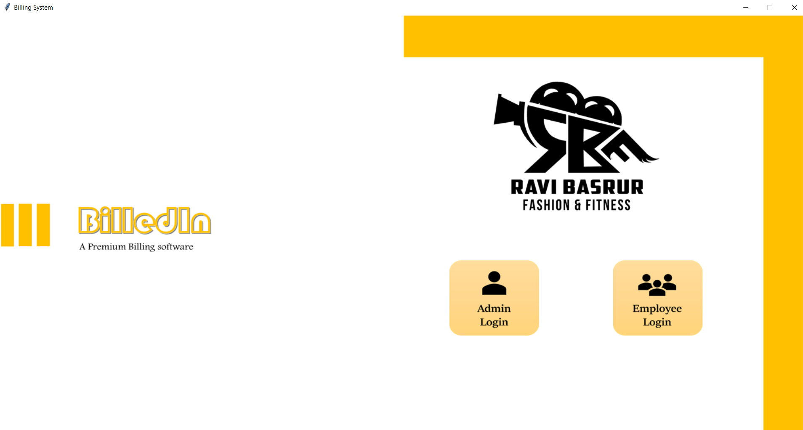
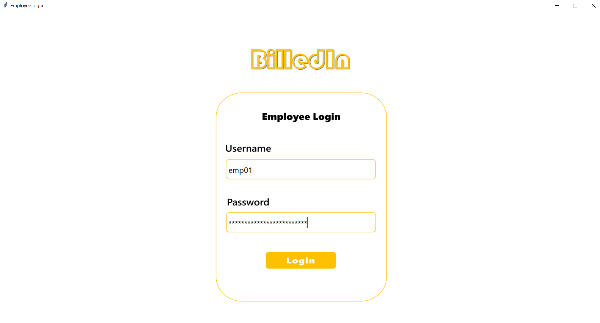
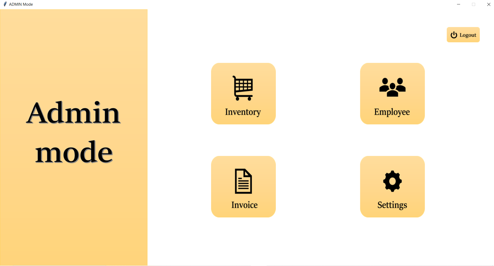
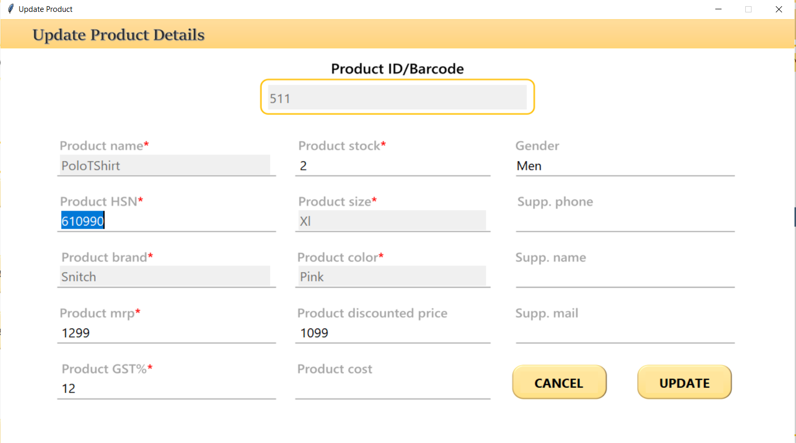
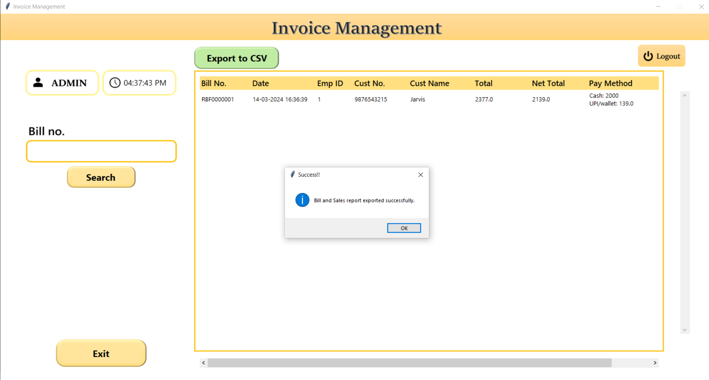
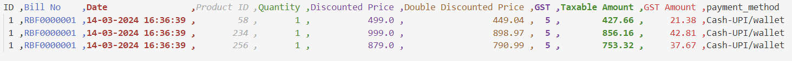

# BilledIn

BilledIn is a simple billing system (Desktop application) for small businesses. It is designed to be easy to use and easy to understand. It is completely written in Python and uses the Tkinter library for the GUI and SQLite for the database.

## Features

- **Main Screen**

  - The main screen of the application is where the user will get an option to login as admin or as an employee.
    

- **Employee Login**

  - The employee can login using their employee ID and password. One standout feature of the application is that the employee can only login if the admin has created an account for them. Additionally, the password is encrypted, ensuring the security of the employee's account.
    

- **Admin Mode**

  - The admin can login using the default username and password, which is "admin01" and "admin01" respectively.
    
  - List of things the admin can do:
    - Inventory Management
    - Employee Management
    - Invoice Management
    - Settings

- **Inventory Management**

  - The admin can search, add, update, delete, and generate barcode stickers for the products.
    
  - Update Product
    

- **Employee Management**

  - The admin can search, add, update, and delete employee accounts.
    
  - Add Employee
    

- **Invoice Management**

  - The admin can search invoices, generate bills, and create sales reports.
    
  - Sales Report
    

- **Billing Screen**

  - The employee can generate bills for the customers.
    

- **Barcode Sticker**
  - The admin can generate barcode stickers for the products.
    

## Installation

1. **Clone the Repository:**

   ```bash
   https://github.com/Akshayffb/Desktop-Billing-Software.git
   cd Desktop-Billing-Software
   ```

2. **Create and Activate a Virtual Environment:**

   ```bash
   python -m venv venv
   venv\Scripts\activate  # On Windows
   ```

3. **Install the Required Packages:**

   ```bash
   pip install -r requirements.txt
   ```

4. **Run the Application:**
   ```bash
   python app.py
   ```

## License

This project is licensed under the MIT License - see the [LICENSE](LICENSE) file for details.

## Additional Commands

To ensure that all required packages are installed, use the following commands:

```bash
pip install pywin32 svgwrite python-barcode keyboard
```
